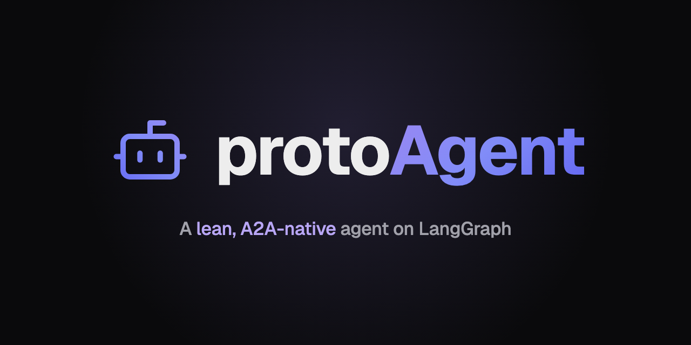
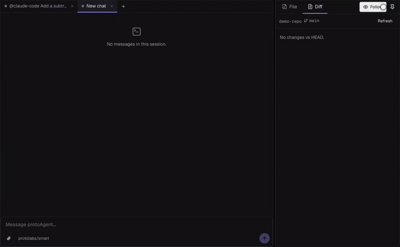
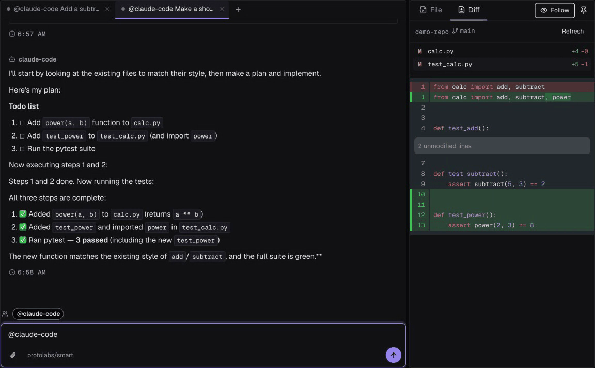
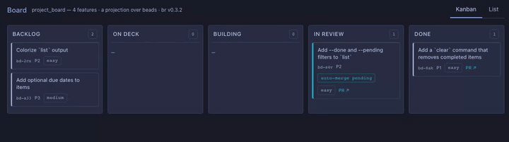
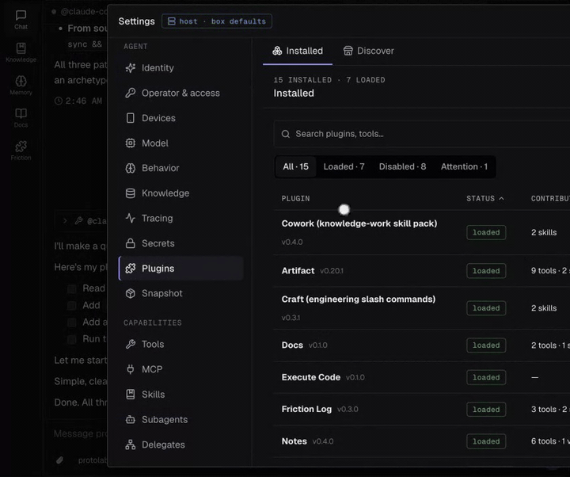

<p align="center">
  
</p>

<h3 align="center">Your local agent, handing real coding work to Claude Code and Codex.</h3>

<p align="center">
  A private, plugin-extensible desktop agent. It plans and remembers, and it gives the coding
  to the CLI agents you already use, over the Agent Client Protocol. Your chats, memory and
  tasks stay in SQLite on your disk. No analytics, tracking or telemetry — <a href="./docs/explanation/network-egress.md">what it does call out to</a>.
</p>

<p align="center">
  <a href="https://agent.protolabs.studio/download"></a>
  <a href="https://pypi.org/project/protolabs-agent/"></a>
  <a href="./LICENSE"></a>
  <a href="https://agent.protolabs.studio/docs/"></a>
  <a href="https://github.com/protoLabsAI/protoAgent/actions/workflows/checks.yml"></a>
</p>

<p align="center">
  
</p>

<p align="center"><em>protoAgent hands a coding task to Claude Code. The diff pane fills in as the files change, and the tests pass.</em></p>

## Get it running

**Desktop app (beta)** — [download for macOS, Windows or Linux](https://agent.protolabs.studio/download).
About 100 MB installed with the server bundled; no Python, Node or other runtime is downloaded at first launch. The macOS
build (Apple Silicon) is signed and notarized; the Windows and Linux builds are unsigned for now.

**One command** — with [uv](https://docs.astral.sh/uv/) installed:

```bash
uvx --from protolabs-agent protoagent serve
```

then open <http://localhost:7870>.

**From source:**

```bash
git clone https://github.com/protoLabsAI/protoAgent.git && cd protoAgent
uv sync && uv run python -m server
```

Whichever you pick, the setup wizard connects any OpenAI-compatible endpoint — a hosted
provider, a LiteLLM gateway, or a local Ollama — then names your agent and picks an
archetype. The [first-agent tutorial](./docs/tutorials/first-agent.md) walks every step.

## Watch it

| Your agent drives Claude Code / Codex | An autonomous dev team | A private desktop agent |
| --- | --- | --- |
| <a href="docs/public/readme/hero-code-pane.gif"></a> |  |  |
| `delegate_to` hands a coding task to a CLI coding agent over ACP, streams its work into your chat, and brings the result back. [Spawn CLI coding agents →](./docs/guides/coding-agents.md) | The **Project Manager** archetype runs the pipeline: brief → board card → disposable worktree → pull request → CI gates → merge. [Build with a coding agent →](./docs/guides/build-with-a-coding-agent.md) | Runs on your machine. Plugins installed from any git URL add tools and console views. [Download →](https://agent.protolabs.studio/download) |

If protoAgent saves you a step, a ⭐ helps other people find it.

## Why it's built this way

- **Local and inspectable.** Chats, memory, knowledge and tasks live in SQLite files on your
  disk, and the code ships no analytics or tracking. Tracing (Langfuse) and metrics are
  opt-in and point wherever you configure them.
- **Plugins from any git URL.** `protoagent plugin install <url>` adds tools, skills,
  subagents and console rail views, pinned in `plugins.lock` — no fork required.
- **A2A 1.0 native.** Every agent serves an agent card and JSON-RPC over `/a2a`, so agents
  delegate to each other over an open protocol ([ADR 0014](./docs/adr/0014-a2a-1.0-migration.md)).
- **Headless if you want it.** Skip the console: an OpenAI-compatible `/v1` API, A2A, and
  Prometheus `/metrics` — see [Run headless](#run-headless).
- **MIT, built on LangGraph.** A small core you can read, extend with plugins, or fork.

## From source, step by step

```bash
# 1. Get the code (no fork needed for a first run)
git clone https://github.com/protoLabsAI/protoAgent.git my-agent
cd my-agent

# 2. Install deps + run — uv (recommended): creates the venv, installs the
#    core deps from pyproject.toml, and runs the server. No env vars required.
uv sync && uv run python -m server          # core, serves the React console (--ui console)
# Already synced? `uv run --no-sync python -m server` skips the re-resolve.

# 2b. Or with pip — `requirements.txt` installs the core runtime:
#   python -m venv .venv && source .venv/bin/activate
#   pip install -r requirements.txt        # == pip install -e .
#   python -m server

# 3. Open the wizard — pick your endpoint, pick a model, name the
#    agent, pick an archetype (Basic, Cowork, Project Manager, Design System
#    Engineer — or any installed bundle that declares one), hit Launch. The
#    console chat appears once setup completes.
open http://localhost:7870
```

[First-agent tutorial](./docs/tutorials/first-agent.md) walks
through every wizard step with screenshots.

Once you're happy and want to ship it as your own agent, see
[Build your own agent](#build-your-own-agent).

## The `protoagent` command

To manage a running protoAgent from a terminal (including the desktop app's hub) without a
clone, install the CLI from PyPI:

```bash
uv tool install protolabs-agent   # or: pipx install protolabs-agent
protoagent fleet                  # the fleet deck over the running hub
```

A clone doesn't put `protoagent` on your PATH; there, run `uv run python -m server <subcommand>`.
See [the `protoagent` command](./docs/guides/cli.md) for every subcommand.

## One-command install (Docker)

No clone, no Python — for a fresh box you just SSH'd into. Pulls the published
image, runs it, and walks a CLI wizard (the same `/api/config/*` endpoints the
browser wizard uses) to configure a provider, model, and agent name:

```bash
curl -fsSL https://raw.githubusercontent.com/protoLabsAI/protoAgent/main/scripts/install.sh | sh
```

Re-running updates the image (the data volume is preserved) and offers to
re-run the wizard. Works over a plain SSH session — with no TTY it starts the
container and points you at the console to finish. See
[Deploy with Docker → one-command install](./docs/guides/deploy-docker.md#one-command-install).

## Run headless

The web console is optional — protoAgent is an **API-first agent server**. Run it
headless and drive it over HTTP via the **OpenAI-compatible** API, the **A2A** protocol,
or both. Same agent, tools, skills, memory, and goals — no browser.

```bash
python -m server --ui none --host 0.0.0.0   # API + A2A + /metrics, no UI

# OpenAI-compatible — point any OpenAI client at the base URL:
curl localhost:7870/v1/chat/completions -H "Authorization: Bearer $TOKEN" \
  -d '{"messages":[{"role":"user","content":"hi"}]}'

# A2A — the agent card + JSON-RPC endpoint other agents/fleets call:
curl localhost:7870/.well-known/agent-card.json
```

`--ui` tiers: `console` (React + API, default) · `none` (headless). `full` is a
deprecated alias for `console`. See [Run headless](./docs/guides/headless.md).

## Plugins

A plugin is a drop-in package — a repo with a `protoagent.plugin.yaml` manifest — that
extends a **running** agent without forking: tools, `SKILL.md` skills, subagents,
workflows, FastAPI routes, background surfaces, managed MCP servers, **console rail
views**, and its own config / secrets / Settings. Install one from a git URL:

```bash
python -m server plugin install https://github.com/you/your-plugin   # pinned in plugins.lock
python -m server plugin uninstall your-plugin --purge                # removes code, config + secrets
```

**Browse the directory → [agent.protolabs.studio/plugins](https://agent.protolabs.studio/plugins)**

First-party plugins ship in `plugins/` — `delegates` is a built-in, `notes`, `docs`,
`artifact`, `craft`, and `cowork` are on by default (cowork also turns on `execute_code`), and the rest are opt-in (enable via `plugins.enabled`):

| Plugin | Adds | What it does |
| --- | --- | --- |
| [`delegates`](./plugins/delegates/) | tool · settings | **Built-in** — `delegate_to` over a2a / openai / acp, managed in Workspace ▸ Delegates |
| [`notes`](./plugins/notes/) | tools · view | **On by default** — one shared markdown note the agent and operator both read/write |
| [`docs`](./plugins/docs/) | tools · view · skill | **On by default** — offline search over protoAgent's own docs |
| [`artifact`](./plugins/artifact/) | tools · view · skill | **On by default** — generative UI; `show_artifact` renders charts, diagrams, Mermaid, Markdown, or live React into a sandboxed panel ([ADR 0038](./docs/adr/0038-generative-ui-artifacts-two-mode.md)) |
| [`craft`](./plugins/craft/) | skills · subagent | **On by default** — engineering rituals as slash commands (`/grill`, `/standup`, `/code-review`, `/due-diligence`, `/writing-skills`) + the agent-retrievable `adr-authoring` skill and the `skill_writer` subagent; prompt-only |
| [`engineer`](./plugins/engineer/) | skills | The navigator skill pack behind the **Engineer** archetype — `repo-onboard` (setup + a guided tour, one stop per turn) and `debug-loop` (one checkpoint per turn; you write the fix, the agent reviews). Prompt-only; **off by default** — the [engineer-archetype](https://github.com/protoLabsAI/engineer-archetype) bundle turns it on |
| [`plugin-devkit`](./plugins/plugin-devkit/) | tool · subagent · skill · workflow · view | The authoring kit + reference plugin — the agent can scaffold and build its own plugins |
| [`workflows`](./plugins/workflows/) | tools · view | Declarative multi-step subagent workflows (DAG recipes) with the **Studio** console surface for authoring and live-watching runs; a step can carry `gate: human`, pausing for operator approval before it runs. Opt-in via `plugins.enabled` |
| [`telegram`](./plugins/telegram/) | surface | Run the agent as a Telegram bot — the reference [communication plugin](./docs/guides/communication-plugins.md) |
| [`execute_code`](./plugins/execute_code/) | tool · settings | **On by default via `cowork`** (off with `plugins.disabled: [execute_code]`, which always wins). A Python interpreter the agent runs code in — on desktop, provision the one-click [managed runtime](./docs/guides/python-runtime.md) and the document skills (docx · xlsx · pptx · pdf) light up |
| [`coder`](./plugins/coder/) | tool · settings | Verifier-grounded code-solve (`coder_solve`) — an execution-grounded search ladder for testable coding tasks ([guide](./docs/guides/coder.md)) |
| [`cowork`](./plugins/cowork/) | skills · verifier | **On by default** — the knowledge-work pack behind the **Cowork** archetype ([ADR 0083](./docs/adr/0083-cowork-mode-archetype.md)) — clean-room Word/Excel/PowerPoint/PDF skills that produce real files through `execute_code`, plus `/daily-brief`, drop-folder watches (the `cowork:folder_changed` verifier), schedule, memory-consolidation and writing-voice habits. Being on also turns on `execute_code`, which the document skills run in. Turn it off with `plugins.disabled: [cowork]` |
| [`agent_browser`](./plugins/agent_browser/) | tools · view · skill · workflows · settings | A real browser for the agent, backed by the native [agent-browser](https://github.com/vercel-labs/agent-browser) CLI — accessibility-tree snapshots + `@eN` refs, page→PDF, and a **drivable** viewport panel you and the agent share ([guide](./docs/guides/browser-automation.md)). Opt-in; needs the `agent-browser` binary on PATH |
| [`friction`](./plugins/friction/) | tools · view · skill · subagent · settings | Friction log — the agent records its own missing/awkward tooling and confusing errors, and **open friction is projected into its working state** so it acts on the backlog instead of re-reporting it. `/friction` for the operator, a read-only `friction_triage` delegate for filing — [operator guide](./docs/guides/friction-log.md) |
| [`orgchart`](./plugins/orgchart/) | view | Live diagram of the agent fleet — every agent a node, delegation edges drawn as they happen |
| [`hello`](./plugins/hello/) | tool · skill · view | Minimal example — copy it to start your own |

Integrations like **Discord**, **Slack** (Socket Mode `ChatAdapter`), **Google**
Gmail/Calendar (managed MCP server with in-app OAuth), and **GitHub**
([github-plugin](https://github.com/protoLabsAI/github-plugin): issues/PR rail over `gh`,
read-only until `github.write: true` — the Project Manager archetype ships it on) install
as **external plugins** from their own repos — see the
[plugin directory](https://agent.protolabs.studio/plugins).

**Chat integrations** (Discord, Telegram, Slack, …) share a contract — implement a
small `ChatAdapter` (connect / receive / send) + a manifest and the admin-gating,
per-conversation threads, reply-chunking, lifecycle, and Test button are handled for
you. See [Build a communication plugin](./docs/guides/communication-plugins.md)
([ADR 0029](./docs/adr/0029-communication-plugins-standard.md)).

**Publish your own:** tag your repo with the [`protoagent-plugin`](https://github.com/topics/protoagent-plugin)
GitHub topic, then open a PR adding an entry to
[`config/plugin-directory.yaml`](./config/plugin-directory.yaml) and run
`python scripts/plugin_directory.py build` — that one entry drives both the in-app
Discover catalog and the website directory (the JSON files are generated; CI fails on
drift). See [Install & publish plugins](./docs/guides/plugin-registry.md),
[Extend protoAgent](./docs/guides/extend.md), [Plugins](./docs/guides/plugins.md), [Console views](./docs/guides/plugin-views.md).

## Architecture

```
┌──────────────┐     A2A JSON-RPC + SSE      ┌─────────────────┐
│   Consumer   │ ──────────────────────────▶ │  A2A handler    │
│  (any A2A    │                             │  (FastAPI)      │
│   client)    │ ◀─── cost-v1 (metadata) ────│                 │
└──────────────┘                             └────────┬────────┘
                                                      │
                                                      ▼
                                            ┌─────────────────┐
                                            │  graph/agent.py │
                                            │  (LangGraph     │
                                            │   create_agent) │
                                            └────────┬────────┘
                                                      │
                                                      ▼
                                            ┌─────────────────┐
                                            │  LiteLLM        │  ← model selection
                                            │  gateway        │    lives here,
                                            └─────────────────┘    not in code
```

The A2A handler never talks to the LLM directly — it submits a
message to the LangGraph runtime, which owns the tool loop and the
subagent `task()` delegation.

<details>
<summary><b>Full feature map</b></summary>

| Concern | Where it lives | What it does |
|---|---|---|
| A2A server | `server/a2a.py`, `a2a_impl/executor.py` | JSON-RPC 2.0 over `/a2a`, SSE streaming, `tasks/*` lifecycle, push notifications, well-known agent card, dual token-shape parsing |
| Agent runtime | `graph/agent.py`, `server/` | LangGraph `create_agent()` wired to the A2A handler, with streaming token capture for cost-v1 |
| LLM gateway | `graph/llm.py` | OpenAI-compatible client pointed at LiteLLM — swap models by editing the gateway config, not the fork |
| Subagents | `graph/subagents/config.py` | DeerFlow-pattern delegation via a `task()` tool; one worked example ships — a `researcher` (web + memory, plan→search→synthesize→cite) |
| Delegate to other agents | `plugins/delegates/`, `plugins/coding_agent/` | **`delegate_to`** routes a sub-task to another agent or endpoint over **a2a / openai / acp** — a **built-in** registry, managed + hot-swappable from the console (**Workspace settings ▸ Delegates**), with a health prober. The **acp** type spawns a CLI coding agent (e.g. protoCLI) over the Agent Client Protocol. See [Delegates](./docs/guides/delegates.md), [Spawn CLI coding agents](./docs/guides/coding-agents.md), ADR [0024](./docs/adr/0024-spawn-cli-coding-agents-acp.md) / [0025](./docs/adr/0025-unified-delegate-registry-and-panel.md) |
| Starter tools | `tools/lg_tools.py` (memory: `tools/memory_tools.py`; scheduler/tasks/watches: `tools/scheduler_tools.py`; goals: `tools/goal_tools.py`; curation/skill/SOUL/config editors + fleet diagnostics: `tools/self_edit_tools.py`) | What an agent has **before any plugin**. Always bound: 4 general (`current_time`, `calculator` safe AST eval, `web_search` via DuckDuckGo, `fetch_url`), 2 lead-only HITL (`ask_human`, `request_user_input`), `show_component` (inline table/keyvalue/timeline widgets), `load_skill`, 3 curation (`recent_activity`/`list_skills`/`save_skill`), and `show_config` (read-only merged config, secrets masked). Bound with their store — all built by default: 7 memory/knowledge, 4 scheduler (incl. `wait`), 4 tasks, 1 inbox. Flag-gated: the goal + watch tools need their flag **and** a registered plugin verifier; `edit_soul` needs `soul.self_edit_enabled`; `onboard_project` needs `onboarding.enabled`; `search_tools` needs `tools.deferred.enabled`. **Not** in `get_all_tools`: notes/docs/artifact tools (on-by-default plugins), `delegate_to` (built-in `delegates` plugin), `task`/`task_batch` (subagent delegation), the fenced filesystem tools, GitHub tools (a separately installed plugin). Drop any via `tools.disabled`; add via a plugin. See [Starter tools](./docs/reference/starter-tools.md) |
| File GitHub issues | `tools/gh_issue.py` | **`/issue`** — a user-only chat command **and** a 🐛 utility-bar form dialog that file a GitHub issue via the `gh` CLI, scaffolding + enforcing the required sections so it clears the repo's issue gate. **Not** an agent tool — creating issues stays in your hands (the `github` plugin's GitHub tools are read-only). Repos are a quick-toggle list configured under **Settings ▸ System ▸ GitHub** (`github.repos` + `github.default_repo`), pairing with the portfolio manager's many-repo setup. See [File GitHub issues](./docs/guides/file-github-issues.md) |
| Knowledge store | `knowledge/store.py`, `knowledge/hybrid_store.py`, `ingestion/` | sqlite + FTS5 keyword search by default; an optional **hybrid** store adds embeddings + RRF fusion, and the **ingestion pipeline** pulls in txt/md/html/pdf/docx/web/YouTube/audio/video sources. One `chunks` table for operator notes and conversation findings. Default-on; turn off with `middleware.knowledge: false` |
| Extensibility | `graph/skills/`, `tools/mcp_tools.py`, `graph/plugins/`, `plugins/` | Opt-in ways to extend a running agent without forking: **`SKILL.md` skills** (AgentSkills format, loaded on demand), **MCP servers** (external tools over stdio/HTTP), and **plugins** — drop-in packages that add tools, skills, subagents, workflows, FastAPI routes, background surfaces, managed MCP servers, **console rail views**, and their own config/secrets/Settings. Plugins are **installable from a git URL** (`protoagent plugin install <url>`, pinned in `plugins.lock`) and shareable as repos — a repo is a full bundle. The first-party **Telegram** (`plugins/telegram`) integration ships bundled; **Discord**, **Slack**, and **Google** Gmail/Calendar install as external plugins from their own repos. Start at **[Extend protoAgent](./docs/guides/extend.md)**; the API is documented in a generated, CI-gated reference ([manifest](./docs/reference/plugin-manifest.md), [registry](./docs/reference/plugin-registry-api.md), [SDK](./docs/reference/plugin-sdk-api.md), [view bridge](./docs/reference/plugin-view-bridge.md), [events](./docs/reference/plugin-events.md), [testkit](./docs/reference/plugin-testkit.md), [CLI](./docs/reference/plugin-cli.md)). See also [Skills](./docs/guides/skills.md), [MCP](./docs/guides/mcp.md), [Plugins](./docs/guides/plugins.md), [Install & publish plugins](./docs/guides/plugin-registry.md), ADR [0001](./docs/adr/0001-extensibility-and-plugin-architecture.md) / [0018](./docs/adr/0018-plugin-surfaces-routes-subagents.md) / [0019](./docs/adr/0019-plugin-config-settings-secrets.md) / [0026](./docs/adr/0026-plugin-contributed-console-surfaces.md) / [0027](./docs/adr/0027-install-plugins-from-git-url.md) |
| Media output channel | `infra/media.py`, `server/media.py`, `graph/multimodal.py` | Tool-generated binary artifacts, both directions: `registry.save_media()` persists an image/audio/video into a core store served by one `GET /media/<file>` route (per-file HMAC-signed URLs render inline in chat even under a bearer gate; `media.public` / `media.retention_days` config), and `multimodal_tool_result()` lets a tool return an image a **vision model actually sees** as ToolMessage content blocks (text-only models degrade to the caption/describe path). See [Plugins ▸ Tapping core deeper](./docs/guides/plugins.md#consumption-sdk) (#1929/#1930) |
| Scheduler | `scheduler/` | `schedule_task` / `list_schedules` / `cancel_schedule` tools backed by a bundled sqlite scheduler. Multi-agent-safe — every job is namespaced by `AGENT_NAME`. See [Schedule future work](./docs/guides/scheduler.md) |
| Eval harness | `evals/` | Side-effect-verified A2A test harness — audit log + reply text + KB state. `python -m evals.runner` against a running agent. See [Eval your fork](./docs/guides/evals.md) |
| Tracing | `observability/tracing.py` | Langfuse trace_session with distributed `a2a.trace` propagation and the OTel cross-context-detach filter |
| Observability | `observability/metrics.py`, `observability/audit.py` | Prometheus metrics with per-agent prefix, JSONL audit log with trace IDs |
| Reasoning-leak guard | `graph/output_format.py` | Reasoning streams on the gateway's native `reasoning_content` channel; `strip_reasoning` removes any raw `<think>` / `<scratch_pad>` blocks a provider leaks into the answer, so they never reach A2A artifacts, the console, or persisted memory |
| UI | `apps/web/` (React console) | React operator console (the default `--ui console` tier + the Tauri desktop app) over the REST/A2A API — live token-by-token streaming, chat continuity across navigation (+ interrupted-stream self-heal), plugin-contributed rail views, a ⌘⇧K command palette + presence-aware Fleet Room, `/export` (save a chat to Markdown) and `/btw` (a side question answered from the chat's context, saved nowhere), and a PWA shell. See [ADR 0010](./docs/adr/0010-headless-setup-and-ui-tiers.md) |
| Fleet deck | `deck/` (Textual TUI), `graph/fleet/cli.py` | The operator's terminal for the fleet — bare `protoagent fleet` / `protoagent top` over the running hub: the roster with the console's presence words, member detail, a fleet-wide work feed, member management (create / rename / delete / remotes / order through `ops/`), every hub on the box (`--all`: attach, or bring a stopped hub up), and conversations with members — steering, HITL answers, delegation cancel — over the same A2A / `/api` surface as the console. Live hub first, badged disk fallback. Bundled in the desktop sidecar. See [ADR 0042](./docs/adr/0042-fleet-supervisor-unified-console.md) (amendment) · [ADR 0075](./docs/adr/0075-external-interfaces-cli-mcp-api.md) (amendment) · [the `protoagent` command](./docs/guides/cli.md) |
| Release pipeline | `.github/workflows/*.yml` | Autonomous semver bumps, GHCR image push, GitHub release with filtered notes, optional Discord post |

</details>

## Skill loop — agents that learn from experience

protoAgent includes an end-to-end **skill loop**. **Human-authored skills**
dropped in as [`SKILL.md`](./docs/guides/skills.md) folders are listed in the
agent's context as an always-on `<available_skills>` index (name + summary); the
agent **loads a skill's full procedure on demand** via the `load_skill` tool when
it judges one fits the task ([progressive disclosure, ADR 0060](./docs/adr/0060-skill-progressive-disclosure.md)).
The agent can also **author its own** skills from a proven workflow via `/distill`
(it writes a new `SKILL.md`), and the skill curator periodically deduplicates,
decays, and prunes non-pinned skills.

| Component | Where it lives | What it does |
|---|---|---|
| `SKILL.md` skills | `config/skills/`, `<config>/skills/`, plugins | Human-authored skills (AgentSkills format) loaded into the index on boot (`source=disk`). Also how the agent self-authors skills, via `/distill`. See [Skills](./docs/guides/skills.md) |
| Skill index | `/sandbox/skills.db` (→ `~/.protoagent`) | SQLite (FTS5) store of loaded skills, read by `KnowledgeMiddleware` |
| Skill index injection | `graph/middleware/knowledge.py` | Lists the index (name + summary) as an always-on `<available_skills>` block; the agent pulls a skill's full body on demand via `load_skill` ([ADR 0060](./docs/adr/0060-skill-progressive-disclosure.md)) |
| Skill curator | `graph/skills/curator.py` | Periodic agent that deduplicates, decays, and prunes non-pinned skills (disk skills are pinned) |

### Running the curator

```bash
# Dry-run — see what would change without touching the index
python -m graph.skills.curator --dry-run

# Full curation pass (deduplicate, decay, prune; writes an audit trail)
python -m graph.skills.curator
```

The curator applies a **90-day confidence half-life** (confidence halves for
every 90 days a skill goes unused), clusters near-duplicate skills by
similarity and keeps the highest-confidence copy, and prunes any non-pinned
skill whose confidence has fallen below 0.2 (disk `SKILL.md` skills are pinned).

See the [Skills guide](./docs/guides/skills.md) and
[architecture § Skill loop](./docs/explanation/architecture.md) for the details.

## A2A extensions shipped by default

Since protolabs-a2a 0.3.0 these ride the **`metadata` map keyed by extension URI** — not
MIME-typed DataParts — so a generic A2A client never renders telemetry as message content.

| URI | Declared on card | Emitted at runtime |
|---|---|---|
| `cost-v1` (`https://proto-labs.ai/a2a/ext/cost-v1`) | Yes | Yes — every terminal artifact's `metadata` carries a cost-v1 fragment with token usage, `durationMs`, `costUsd`, `success` |
| `worldstate-delta-v1` (`https://proto-labs.ai/a2a/ext/worldstate-delta-v1`) | Yes | When tools report observed state mutations — a `deltas[]` fragment on the terminal artifact |
| `tool-call-v1` (`https://proto-labs.ai/a2a/ext/tool-call-v1`) | Yes | Per-tool progress on `statusUpdate` frames while the task is `WORKING` — how a live consumer watches the agent work |
| `a2a.trace` propagation | No (it's a protocol convention, not a card extension) | Yes — reads caller's Langfuse trace context from `params.metadata["a2a.trace"]` and nests this agent's trace under it |

Declare additional extensions on the card in
`server/a2a.py::_build_agent_card_proto` when your agent's skills
actually mutate shared state (see `effect-domain-v1` in
[Extensions](./docs/reference/extensions.md) for when this applies).

## Push notification support

The A2A handler supports both token shapes the spec permits:

```jsonc
// Shape 1 — top-level (what @a2a-js/sdk serialises by default)
{ "url": "https://consumer/callback/abc", "token": "shared-secret" }

// Shape 2 — structured (RFC-8821 AuthenticationInfo)
{
  "url": "https://consumer/callback/abc",
  "authentication": { "schemes": ["Bearer"], "credentials": "shared-secret" }
}
```

Both produce `Authorization: Bearer shared-secret` on outgoing
webhooks. If your fork is getting 401s on callbacks, check which
shape the consumer is sending before changing anything —
the dual-token parser in `a2a_impl/auth.py` reads both and the
test suite covers both.

## Observability

| What | Where | How to use |
|---|---|---|
| Prometheus metrics | `/metrics` | Scrape; metric prefix is `AGENT_NAME_*` (sanitised) |
| JSONL audit log | `/sandbox/audit/audit.jsonl` | `jq` for forensic replay; every entry has `trace_id` |
| Langfuse traces | `LANGFUSE_*` env vars, or **Settings ▸ Tracing** (env wins) | Trace tag is `AGENT_NAME`, so filter by tag to find this agent's runs |
| Container logs | `docker logs <container>` | INFO is the default — `LOG_LEVEL=DEBUG` for more |

## Requirements (from source)

- Python 3.11+ (CI runs 3.12)
- Docker (for the bundled deployment)
- A LiteLLM-compatible OpenAI gateway somewhere on the network
  (see `config/langgraph-config.yaml`)
- Optional: Langfuse, Prometheus, Discord webhook

## Build your own agent

A lean, A2A-native agent on LangGraph — ships a small core, grows with git-URL plugins.
Run one agent or orchestrate a fleet; drive it from a console, the OpenAI-compatible API,
or A2A. Local-first, yours to fork.

It keeps the boring parts — A2A spec handling, cost/extension emission, tracing, the
release pipeline — stable across every agent in the fleet, so forking an agent is close
to a rewrite of `SOUL.md`, `graph/prompts.py`, and `tools/lg_tools.py` and not much else.
You add capability as plugins instead of inheriting a pile of it.

Click **"Use this template"** at the top of the GitHub repo (or
[start from the template](https://github.com/new?template_name=protoAgent&template_owner=protoLabsAI)),
then follow [Customize & deploy](./docs/guides/customize-and-deploy.md) for the fork /
rename / release-pipeline wiring.

**Canonical reference implementation**: [protoLabsAI/roxy](https://github.com/protoLabsAI/roxy).
Roxy is a filled-in fork — an autonomous ProtoMaker portfolio manager with its
own persona, A2A skills, and project registry — a good example of what a fork
looks like end-to-end.

### Release pipeline

The included GitHub Actions pipeline is optional but opinionated.

- **On every merge to `main`** → `docker-publish.yml` builds and
  pushes `ghcr.io/protolabsai/<image>:latest` + `sha-<short>`.
  Watchtower (or similar) can poll `latest` for auto-deploy.
- **To cut a release** → run `prepare-release.yml` manually
  (`workflow_dispatch`, gated on the `RELEASE_ENABLED` repo var, with a
  patch/minor/major bump input). It **only opens** a "chore: release vX.Y.Z"
  bump PR (fleet policy: it does **not** auto-merge or tag). Merge that PR
  through the normal CI/review gate, then push the tag yourself
  (`git tag -a vX.Y.Z -m … && git push origin vX.Y.Z`) — the tag push is what
  triggers `release.yml`. Releases are on-demand, not per-merge.
- **When a semver tag lands** → `release.yml` builds and pushes
  the stable semver Docker tags, creates a GitHub release with
  filtered notes, and posts a Discord embed via the shared
  [`protoLabsAI/release-tools`](https://github.com/protoLabsAI/release-tools) Action.
- **On every PR + push** → `checks.yml` runs the gates: ruff + import
  contracts, `pytest`, an A2A live smoke, a web E2E smoke (vitest +
  Playwright), gitleaks, and `verify-workspace-config` (the fleet
  `.beads`/`.automaker`/owned-runner standard), so drift is caught in CI
  rather than mid-run.

All workflows run on the org-owned `namespace-profile-protolabs-linux`
runner. The three release workflows (`docker-publish`, `prepare-release`,
`release`) gate on `github.repository == 'protoLabsAI/<name>'` so they
no-op on clones that haven't updated the owner — avoids surprise releases
on forks. Update the repo check in all three when forking.

## Contributing

This is a template repo — bugs and improvements to the shared
runtime (the `server/` package, `graph/agent.py`, extension
support, release pipeline) land here. Domain-specific agent logic
lives in the fork, not here.

## License

protoAgent is released under the [MIT License](./LICENSE) — fork it,
build on it, ship it. Bundled first-party plugins carry their own
`LICENSE` (also MIT).
